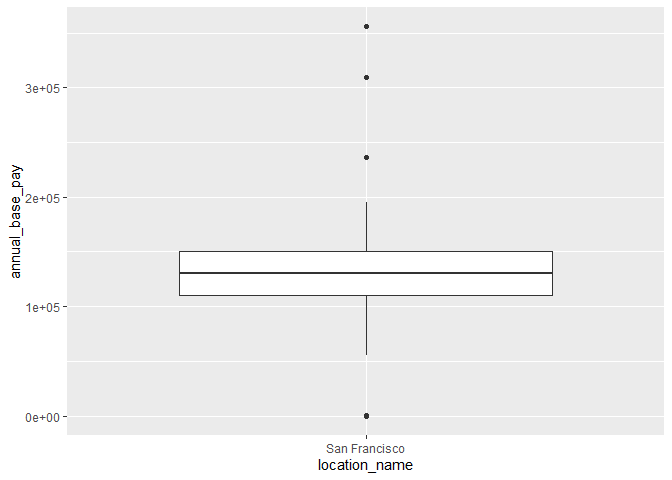
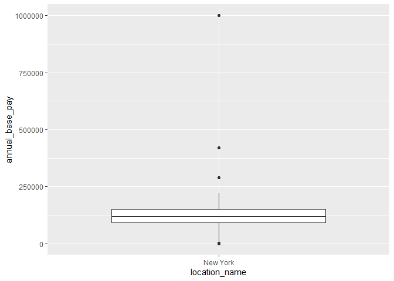
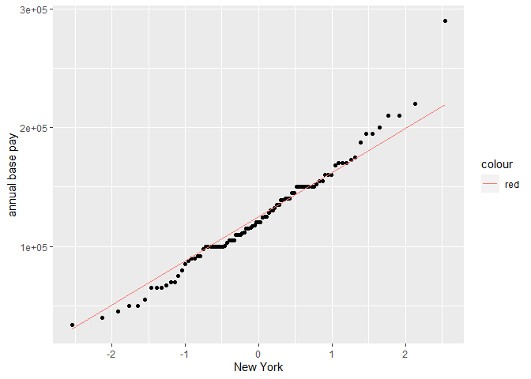
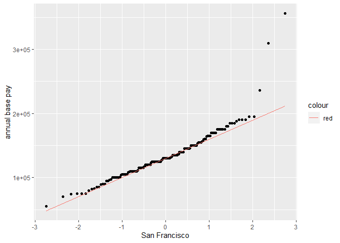
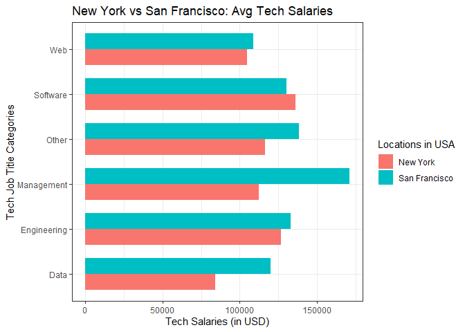
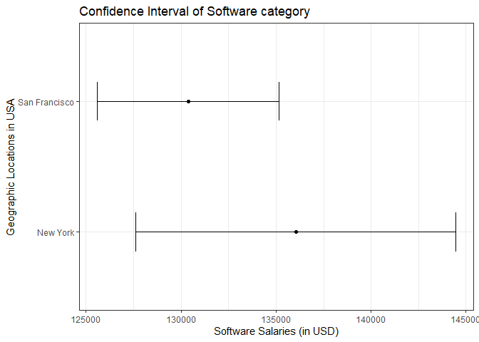

Exploratory Data Analysis
================

<font size= "5">**Data Summary and Hypothesis:**</font>

The dataset I have contains information about tech salaries in different
locations and details about the employers. The data was collected from a
survey conducted on Hacker News in 2016, with responses from 1655
individuals. Each row in the dataset includes the company where the
employee works, the specific geographic location, job description, years
of experience, and annual salary breakdowns. There are 19 variables in
total, including an index.

The categorical variables in the dataset include the employee’s salary
ID, employer name, geographic location (including name, state, and
country), job title, category, and rank. The ratio variables include the
total experience and employer experience in years, location latitude and
longitude, annual base pay, signing bonus, stock value, and annual
bonus. There are also other variables such as comments and submission
time.

Based on this dataset, my hypothesis for the research is that **“The
average yearly base pay salaries in San Francisco are higher than in New
York across all diverse tech job categories.”** The important variables
for this hypothesis are the employer’s name, location name, job title,
job title category, and annual base pay.

<font size= "5">**Planning and Analysis:**</font>

In the initial steps, we gathered the important variables and addressed
any missing values in the dataset.

``` r
knitr::opts_chunk$set(echo = TRUE)
library(dplyr)
library(ggplot2)
library(stringr)
library(knitr)
knitr::opts_chunk$set(echo = TRUE)
```

``` r
data<-read.csv("salaries_clean.csv")

#checking missing values in data
missing.data.whole <- data %>% summarise_all(~ sum(is.na(.))) 

# extracting important variables for my hypothesis
selected.data.new <- select(data,employer_name,location_name,job_title_category,annual_base_pay)

# checking missing data in new dataframe
missing.data.new <- selected.data.new %>% summarise_all(~ sum(is.na(.)))

# removing 4 missing values present in annual base pay
selected.data.new <- selected.data.new[!is.na(selected.data.new$annual_base_pay),]

# checking missing data in new dataframe
missing.data.new <- selected.data.new %>% summarise_all(~ sum(is.na(.)))
kable(missing.data.new)
```

| employer_name | location_name | job_title_category | annual_base_pay |
|--------------:|--------------:|-------------------:|----------------:|
|             0 |             0 |                  0 |               0 |

After removing the missing value rows, we divided the data into separate
dataframes for New York and San Francisco. To ensure consistency in
location names, we used string detection techniques and regular
expressions to identify and rename similar location names.

With distinct dataframes for each city, we employed box plots to
identify outliers. We examined the annual base salary in relation to
other columns and adjusted extreme values that appeared to be outliers,
incorrect inputs, or missing zeros. However, some outliers were deemed
relevant for analysis purposes(cto google rail product with a salary of
\$356000 in “Management” category).

``` r
# selecting data on the basis of location: San Francisco and New York
sf_data <- selected.data.new %>% filter(str_detect(location_name, "^sf|^san fran")) %>% mutate(location_name = "San Francisco")
ny_data <- selected.data.new %>% filter(str_detect(location_name, "^nyc|^new york")) %>% mutate(location_name = "New York")

# checking for outliers for NY and SF
sf_data %>% ggplot(aes(location_name,annual_base_pay))+geom_boxplot()
```



``` r
ny_data %>% ggplot(aes(location_name,annual_base_pay))+geom_boxplot()
```



``` r
#outlier filter of san francisco and New york
new_york_data <- ny_data %>% filter(annual_base_pay>=33500 & annual_base_pay<=290000) # minimum and maximum wage adjustment of New York
san_francisco_data <- sf_data %>% filter(annual_base_pay>=55000) # minimum and maximum wage adjustment of San Francisco
```

To assess normality, we utilized Q-Q plots for both New York and San
Francisco dataframes. The sample sizes for both cities exceeded the
required threshold of 30, satisfying the Central Limit Theorem and
indicating a normal distribution.

``` r
#qq plot to check normality
new_york_data %>% ggplot(aes(sample=annual_base_pay)) + stat_qq() + geom_qq_line(aes(color="red")) + labs(y="annual base pay",x ="New York")
```



``` r
#qq plot to check normality
san_francisco_data %>% ggplot(aes(sample=annual_base_pay)) + stat_qq() + geom_qq_line(aes(color="red")) + labs(y="annual base pay",x ="San Francisco")
```



Comparing the central tendency of annual base pay, we observed that the
mean annual base pay in San Francisco (\$134,089) was higher than in New
York (\$124,228). However, since the hypothesis states that the average
salaries should be higher in “ALL” job title categories, we proceeded to
analyze each job category individually. To accomplish this, we merged
the two dataframes together.

``` r
#The overall average tech salaries of San Francisco is greater than New York, but according to the hypothesis its should be greater is ALL domains we need to check this for each category
summary(new_york_data$annual_base_pay)
```

    ##    Min. 1st Qu.  Median    Mean 3rd Qu.    Max. 
    ##   33500  100000  120000  124228  150000  290000

``` r
summary(san_francisco_data$annual_base_pay)
```

    ##    Min. 1st Qu.  Median    Mean 3rd Qu.    Max. 
    ##   55000  110000  130000  134089  150000  356000

To analyze job title categories in each location, we created a summary
table using group-by operations on the job_title_category and
location_name variables. This table included additional columns for mean
wages and the number of employees per job title category. We identified
that the “Operations” job title category was only present in San
Francisco, so we excluded it from the table to ensure a fair comparison.
To visually represent the differences, we generated a clustered bar plot
based on the summary table and created a mean salary difference table
(San Francisco - New York) for statistical validation.

``` r
#combining the San Francisco and New York data
ny_sf <- rbind(new_york_data,san_francisco_data)
# SUMMARY OF THE NEW COMBINED DATA of New York and San Francisco
# summary(ny_sf)

# table containing mean, no. of employees and standard_error
jcat <- group_by(ny_sf,location_name,job_title_category)
final_chart <- summarise(jcat, mean_sal = mean(annual_base_pay), no_of_employees = n(), .groups = 'drop')

#filtering out operations because its only present in San Francisco
final_chart <- filter(final_chart,job_title_category != "Operations")

# The mean salaries of San Francisco is higher than New York in all job categories except Software. The hypothesis stands incorrect, since Software category is dominating in New York than in San Francisco. Since Software dominated in New York, so i will check the confidence intervals of New York and San Francisco Software salaries.

#new software dataframe
sw_filter <- filter(ny_sf, job_title_category == "Software")

#CI calculations
sw_ci <- sw_filter %>% group_by(location_name) %>% summarise(no_of_employees = n(),mean_salaries = mean(annual_base_pay), CI_min = mean_salaries-1.96*(sd(annual_base_pay)/sqrt(no_of_employees)), CI_max= mean_salaries+1.96*(sd(annual_base_pay)/sqrt(no_of_employees)))

# Sample size of New York software employees is 48 and San Francisco is 98 which is greater than 30 data points which means that the data is normally distributed according to Central Limit Theorem

# mean salary plot
ggplot(final_chart, aes(job_title_category,mean_sal,fill=location_name))+
  geom_bar(stat="identity", width=0.70, position=position_dodge())+ coord_flip() + labs(x="Tech Job Title Categories", y="Tech Salaries (in USD)", title = "New York vs San Francisco: Avg Tech Salaries", fill="Locations in USA") + theme_bw()
```



``` r
kable(final_chart)
```

| location_name | job_title_category |  mean_sal | no_of_employees |
|:--------------|:-------------------|----------:|----------------:|
| New York      | Data               |  84285.71 |               7 |
| New York      | Engineering        | 126833.33 |               9 |
| New York      | Management         | 112222.22 |               9 |
| New York      | Other              | 116192.31 |              13 |
| New York      | Software           | 136036.46 |              48 |
| New York      | Web                | 104600.00 |               5 |
| San Francisco | Data               | 120200.00 |               5 |
| San Francisco | Engineering        | 133022.50 |              16 |
| San Francisco | Management         | 171000.00 |              15 |
| San Francisco | Other              | 138304.35 |              23 |
| San Francisco | Software           | 130371.43 |              98 |
| San Francisco | Web                | 108857.14 |               7 |

Upon examining the bar plot and mean salary difference table, we found
that the average tech job salaries in San Francisco were generally
higher than in New York across all categories, except for the “Software”
category. This finding contradicts the hypothesis, as the “Software”
category had higher salaries in New York compared to San Francisco.
Although the overall average tech income in San Francisco was higher,
analyzing salaries by job title category revealed a \$5,665 gap favoring
New York in the “Software” category. The bar plot demonstrated that
average salaries in the “Management” category were the highest in San
Francisco compared to other domains. Comparing the two cities, the mean
differences in salaries were particularly significant for “Management,”
“Data,” and “Others” categories, while smaller differences were observed
for “Web,” “Software,” and “Engineering.”

Because the “Software” job category prevailed in New York, we will
compare the confidence intervals of wages in the Software job title
category in New York and San Francisco to draw some conclusions. As
sample size of “Software” job category in New York and San Francisco 48
and 98, respectively which is greater than 30. We can say that the
sample is normally distributed according to Central Limit Theorem.
Considering the value of 1.96 from Z-scores for 95% confidence interval,
we calculate the confidence interval minimum and maximum values for
“Software” salaries for both cities. The values of the confidence
interval are shown in the below table, and a CI plot is made based on
the table values. On comparing the two-confidence interval plots we can
see that the mean salary of San Francisco lies in the 95% range of New
York but vice versa is not true. The mean annual salary of New York -
San Francisco dataframe (\$130,597) also lies in the 95% confidence
interval of both plots.

``` r
ggplot(sw_ci,aes(location_name,mean_salaries)) + geom_errorbar(aes(x=location_name, ymin=CI_min, ymax=CI_max), width=0.3)+labs( x= "Geographic Locations in USA",y="Software Salaries (in USD)", title = "Confidence Interval of Software category") + geom_point()+ coord_flip()+theme_bw()
```



``` r
kable(sw_ci)
```

| location_name | no_of_employees | mean_salaries |   CI_min |   CI_max |
|:--------------|----------------:|--------------:|---------:|---------:|
| New York      |              48 |      136036.5 | 127614.6 | 144458.3 |
| San Francisco |              98 |      130371.4 | 125591.0 | 135151.9 |

<font size= "5">**Conclusion:**</font>

Based on the analysis and results, we can conclude “Software” job title
category has higher average annual base pay in New York than in San
Francisco even though San Francisco has higher mean annual salaries
overall and in all other job categories. Also, the stated hypothesis
happens to be partially correct but still, it is invalid. The hypothesis
can be changed to “San Francisco has higher average yearly base pay
earnings than New York in all tech job categories except software” or
“The average annual salary for the Software job category is higher in
New York than in San Francisco”.
